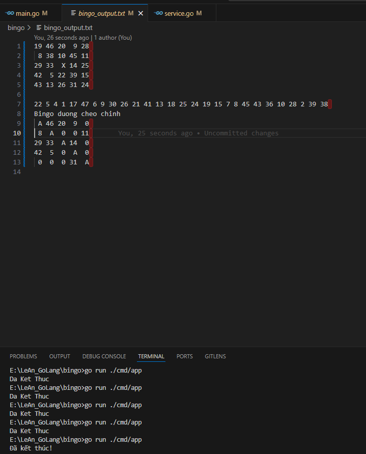

# Bài tập: Ứng dụng Bingo

## Yêu cầu

- **Tạo page bingo**: Sinh ngẫu nhiên một bảng bingo 5x5, xuất ra file `bingo_output.txt` (5 dòng đầu là bảng bingo).
- **Quay số**: Mỗi 2 giây random một số, xuất ra file (dòng 6, các số cách nhau bằng dấu cách).
- **Kiểm tra bingo**: Nếu bảng đã bingo (ngang, dọc hoặc chéo), dừng quay số.
- **Xuất kết quả**:
  - Dòng 7: Xuất ra dòng thông báo đã bingo (ngang/dọc/chéo nào).
  - Dòng 8-12: Xuất lại bảng bingo, số nào đã xuất hiện thì thay bằng 0, các ô bingo đánh dấu đặc biệt (theo code mẫu là ký tự A hoặc [..]).

## Cấu trúc dự án

```
bingo/
├── cmd/
│   └── app/
│       └── main.go                 # Entry point của ứng dụng
├── internal/
│   ├── bingo/
│   │   └── bingo.go                # Logic tạo board và check bingo
│   ├── file/
│   │   └── file_handler.go         # Xử lý các thao tác với file
│   └── service/
│       └── service.go              # Service chính điều phối game
├── demo/
│   └── ketqua.png                  # Hình ảnh minh họa kết quả
├── go.mod                          # Go module file
├── bingo_output.txt                # File output kết quả game
└── README.md                       # Tài liệu hướng dẫn
```

## Mô tả các thành phần

- **main.go**: Điểm khởi đầu chương trình, chỉ gọi service để chạy game
- **bingo.go**: Chứa 2 hàm chính:
  - `CreateBingoBoard()`: Tạo bảng bingo 5x5
  - `CheckBingo()`: Kiểm tra điều kiện bingo
- **file_handler.go**: Xử lý tất cả thao tác ghi file output
- **service.go**: Service chính tổ chức và điều phối toàn bộ logic game

## Kết quả demo

Ảnh minh họa kết quả file output:



## Hướng dẫn chạy

1. Build và chạy chương trình:
   ```bash
   go run ./cmd/app
   ```
2. Xem kết quả trong file `bingo_output.txt`.

---

- Mỗi lần chạy sẽ ra một bảng bingo và kết quả khác nhau.
- Có thể thay đổi logic đánh dấu hoặc xuất file theo ý muốn.
