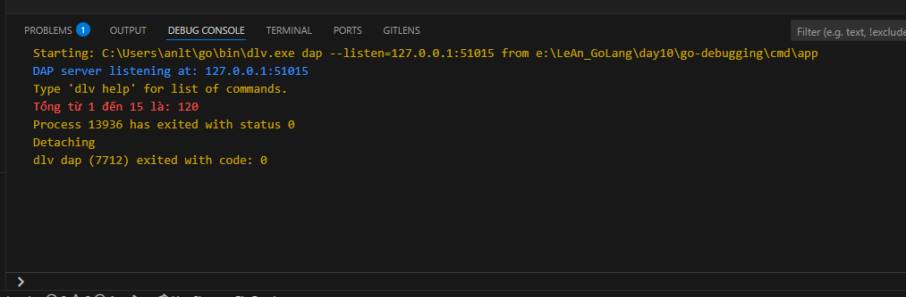

# Go Debugging Example with VS Code & Delve

## Overview

This project demonstrates how to debug Go code using Visual Studio Code and the Delve debugger. You will learn how to:

- Set breakpoints
- Inspect variables and call stack
- Step through code
- Debug functions with loops and calculations

## Requirements

- Go (>=1.18)
- Visual Studio Code
- [Go extension for VS Code](https://marketplace.visualstudio.com/items?itemName=golang.Go)
- Delve debugger (usually installed automatically with the Go extension)

## Example Code

- `main.go` includes:
  - A `sum(n int) int` function with a for loop
  - A `calculate(a, b float64, op string) float64` function
  - Example usage in `main()` for both functions

## How to Debug in VS Code

### 1. Open the Project

- Open the folder `day10/go-debugging` in VS Code.

### 2. Set Breakpoints

- Open `cmd/app/main.go`.
- Click to the left of the line numbers to set breakpoints, e.g.:
  - Inside the `for` loop in `sum`
  - Before and after calling `sum` in `main`

### 3. Start Debugging

- Press `F5` or click the green Run/Debug button.
- Choose `Launch` if prompted.
- The program will stop at your breakpoints.

### 4. Inspect & Step

- Use the **VARIABLES** panel to see current values (e.g. `i`, `total`, `n`)
- Use the **CALL STACK** panel to see which function is running
- Use the **WATCH** panel to track custom expressions
- Use the step buttons to step over, into, or out of functions

### 5. Example Debug Session

- See the screenshots below for a typical debug session:

#### Set breakpoints and inspect variables

#### Step through the for loop

#### View output in Debug Console

## Tips

- You can add/remove breakpoints at any time.
- Hover over variables in the editor to see their values.
- Use the Debug Console to evaluate expressions.

## References

- [Delve Debugger](https://github.com/go-delve/delve)
- [Go VS Code Debugging Docs](https://code.visualstudio.com/docs/languages/go#_debugging)
