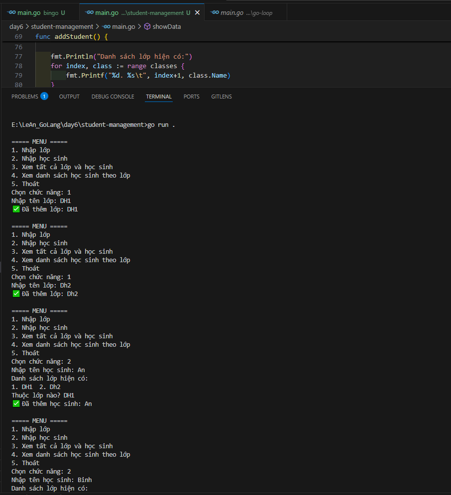
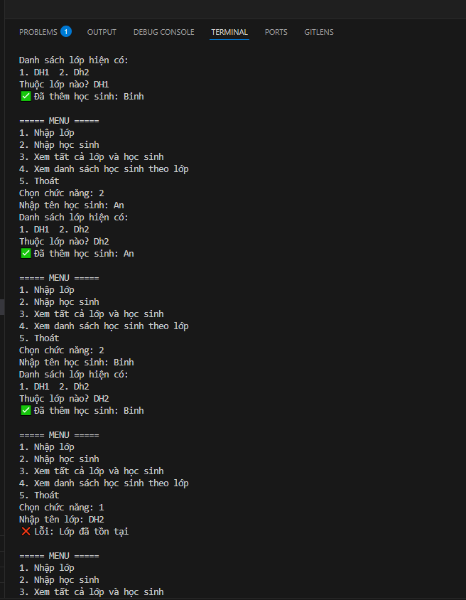
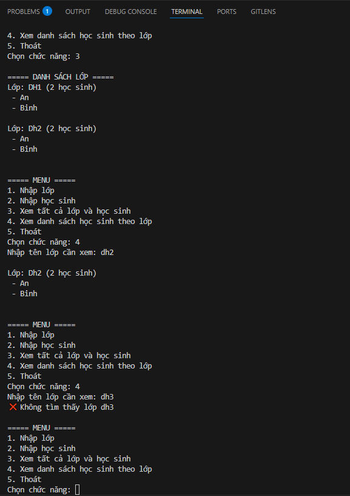
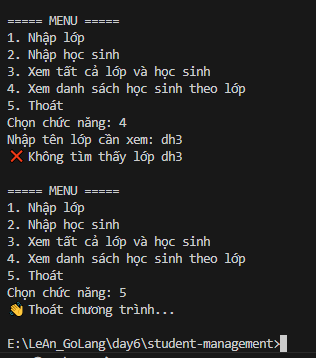

# 📘 Quản lý Trường học (Go Project)

## 📝 Bài toán

Viết chương trình quản lý **lớp học** và **học sinh** chạy trên **console** bằng ngôn ngữ Go.  
Người dùng nhập dữ liệu từ bàn phím và chương trình xuất kết quả ra màn hình.

---

## 🎯 Yêu cầu

1. Có 2 struct chính:

   - `Class` (Tên lớp, số lượng học sinh).
   - `Student` (Tên học sinh, lớp).

2. Các chức năng chính:
   - Thêm lớp mới.
   - Thêm học sinh vào lớp.
   - In danh sách lớp và số lượng học sinh.
   - In danh sách học sinh theo từng lớp.
   - Không cho phép thêm **2 lớp trùng tên** (sử dụng **Set** để kiểm tra).
   - Một lớp có thể có nhiều học sinh trùng tên (ví dụ: 3 bạn tên "An" trong cùng một lớp).
   - Số lượng học sinh trong lớp được tính **tự động** khi thêm học sinh, không nhập thủ công.

---

## ▶️ Cách chạy

```bash
go run main.go
```

## Ket Qua





