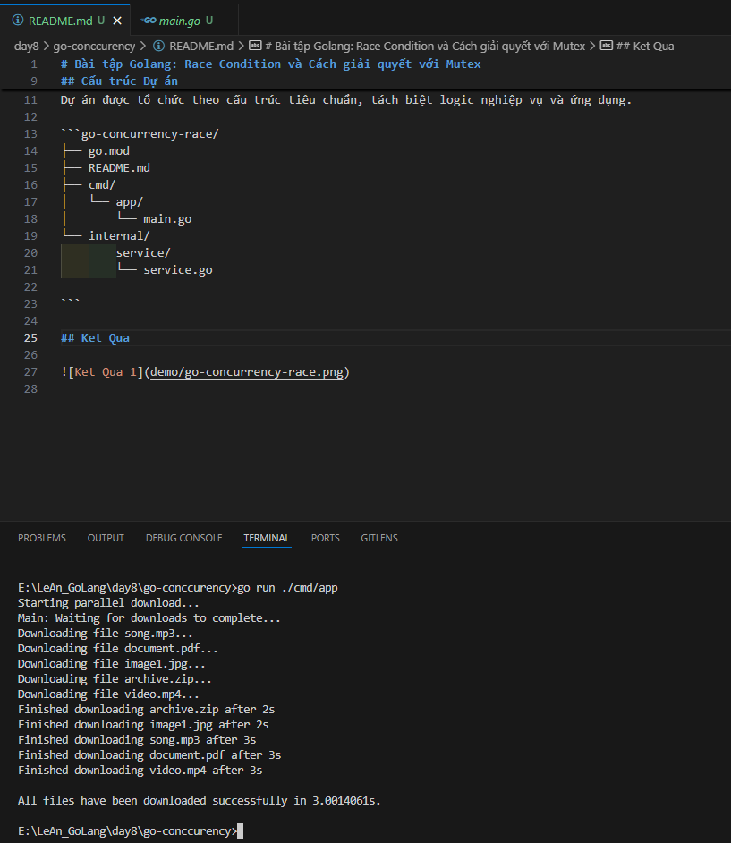

# Bài tập Golang: Race Condition và Cách giải quyết với Mutex

Đây là một bài tập don gian giup ban hieu hieu ve Go Concurrency

## Kịch bản bài toán

Chúng ta sẽ mô phỏng một quy trinh download file don gian

## Cấu trúc Dự án

Dự án được tổ chức theo cấu trúc tiêu chuẩn, tách biệt logic nghiệp vụ và ứng dụng.

```go-concurrency-race/
├── go.mod
├── README.md
├── cmd/
│   └── app/
│       └── main.go
└── internal/
        service/
        └── service.go

```

## Ket Qua


