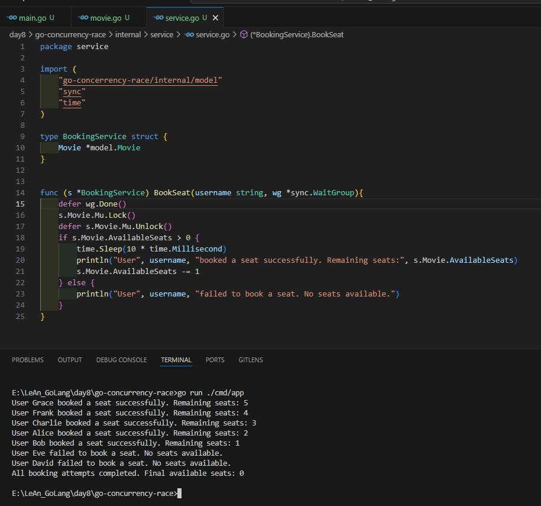

# Bài tập Golang: Race Condition và Cách giải quyết với Mutex

Đây là một bài tập thực hành về lập trình đồng thời (concurrency) trong Go. Mục tiêu là để hiểu rõ về **Race Condition (Cuộc đua dữ liệu)**, một trong những loại lỗi phổ biến và nguy hiểm nhất, và cách sử dụng `sync.Mutex` để giải quyết nó.

## Kịch bản bài toán

Chúng ta sẽ mô phỏng một hệ thống đặt vé cho rạp chiếu phim. Một suất chiếu có số lượng ghế giới hạn, và nhiều người dùng sẽ cố gắng đặt vé cùng một lúc.

- **Phần 1:** Chúng ta sẽ cố ý viết code không an toàn để tạo ra một race condition.
- **Phần 2:** Chúng ta sẽ sửa lỗi bằng cách sử dụng `sync.Mutex` để bảo vệ vùng dữ liệu chia sẻ.

## Cấu trúc Dự án

Dự án được tổ chức theo cấu trúc tiêu chuẩn, tách biệt logic nghiệp vụ và ứng dụng.

```go-concurrency-race/
├── go.mod
├── README.md
├── cmd/
│   └── app/
│       └── main.go
└── internal/
    └── model/
        └── movie.go
        service/
        └── service.go

```

## Ket Qua Khi Khong Xu Ly sync.Mutex



## Ket Qua Khi Co Xu Ly sync.Mutex


