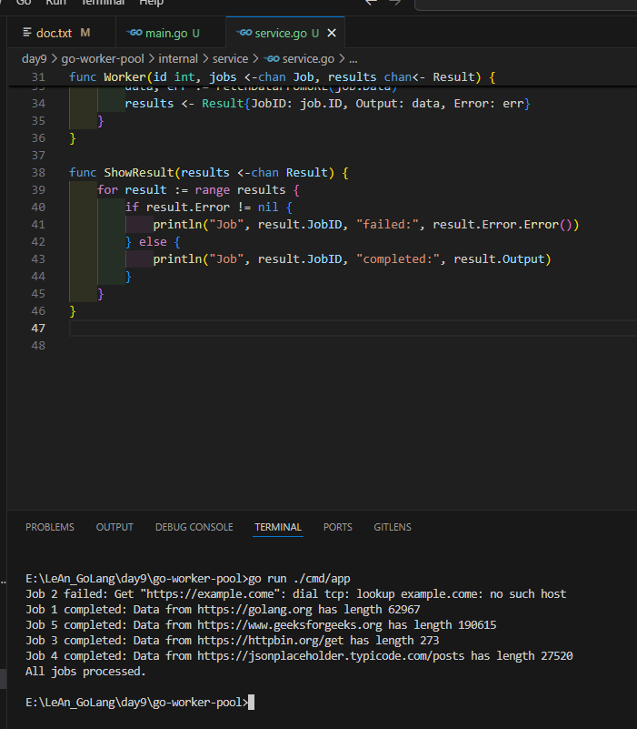

# Bài tập Golang: Ung Dung Lai Bai Tap Fetch Du Lieu Tu URL Su Dung Worker Pool

## Cấu trúc Dự án

Dự án được tổ chức theo cấu trúc tiêu chuẩn, tách biệt logic nghiệp vụ và ứng dụng.

```Project Structure
go-worker-pool/
|
├── go.mod
├── README.md
├── cmd/
│   └── app/
│       └── main.go
└── internal/
    └──service/
        └── service.go

```

## Ket Qua


